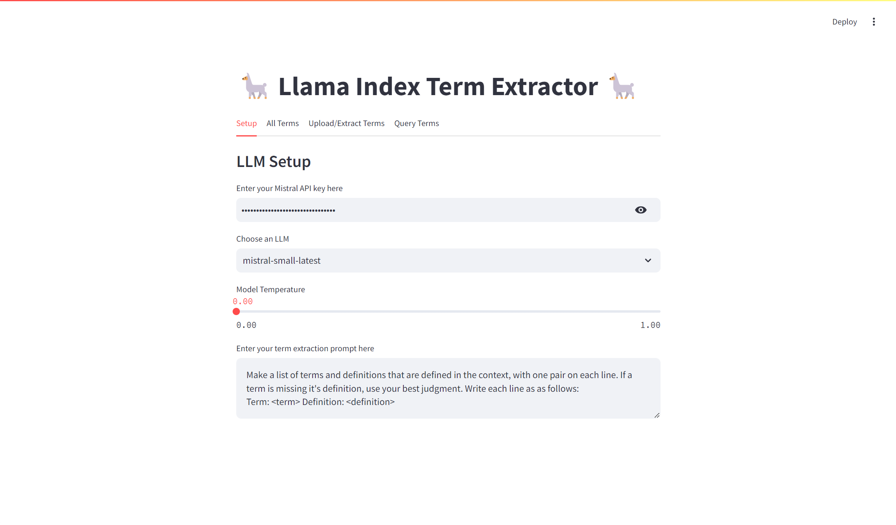
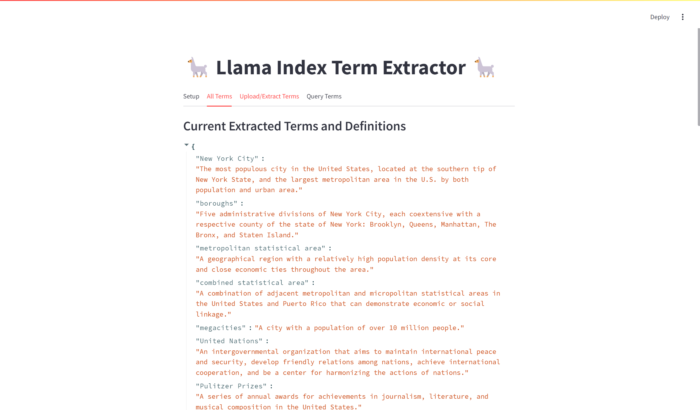
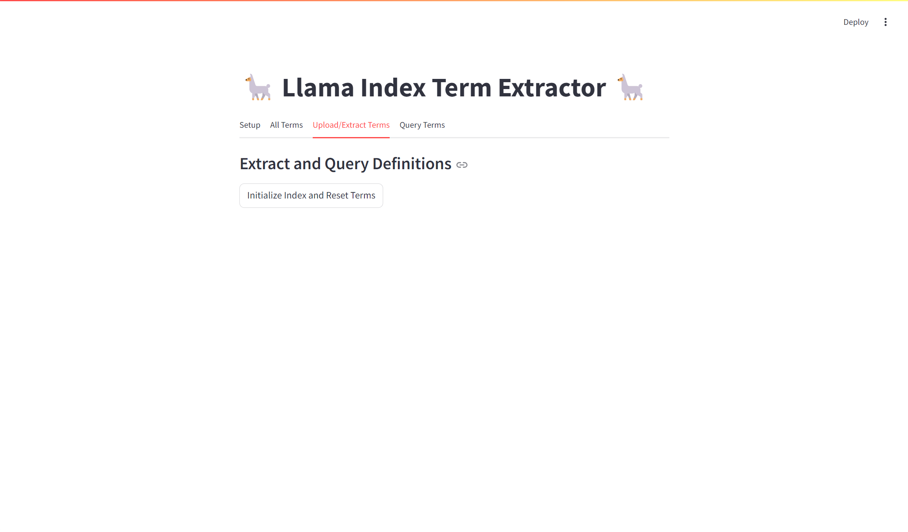
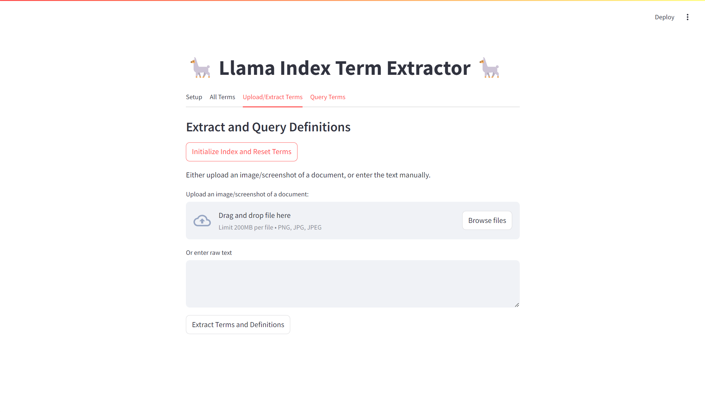
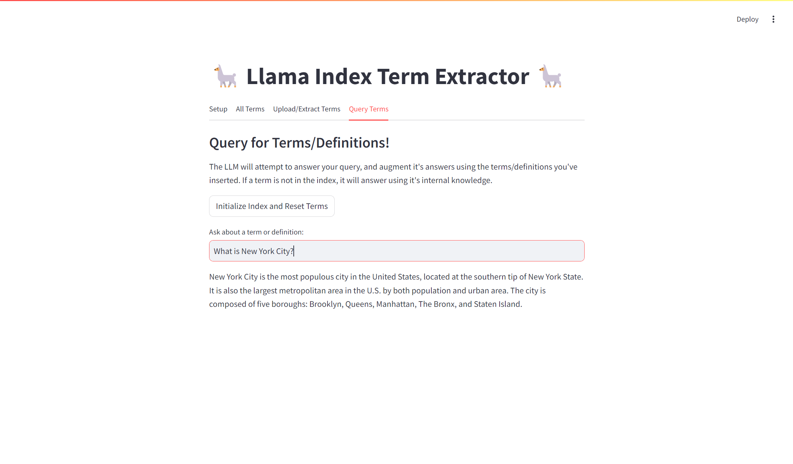
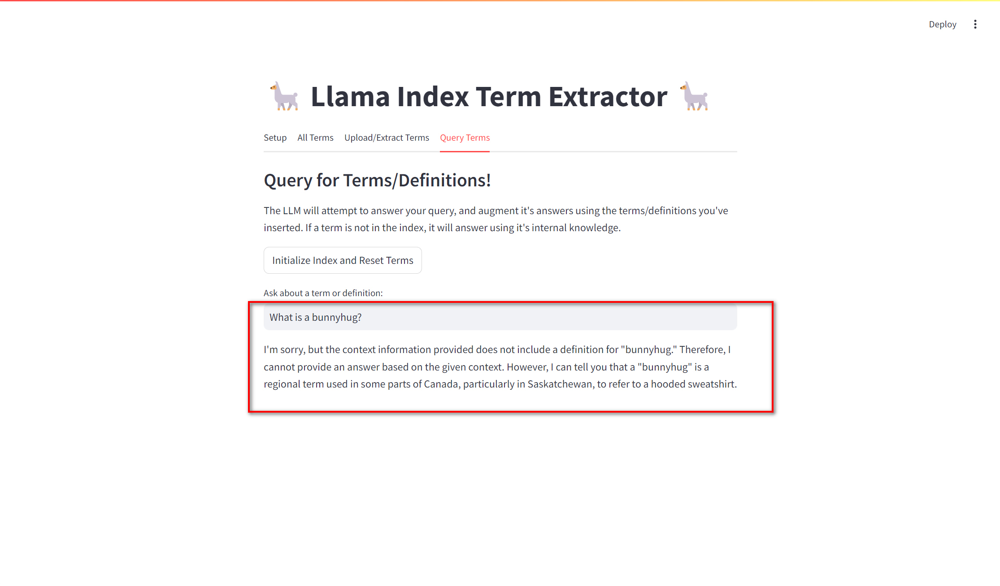
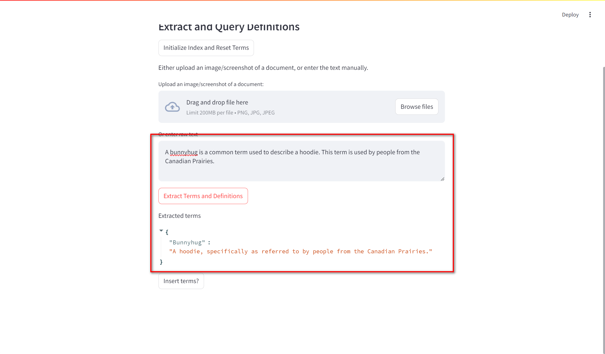
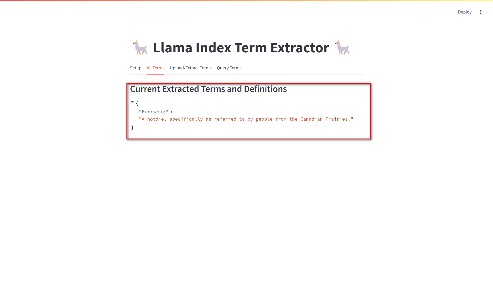
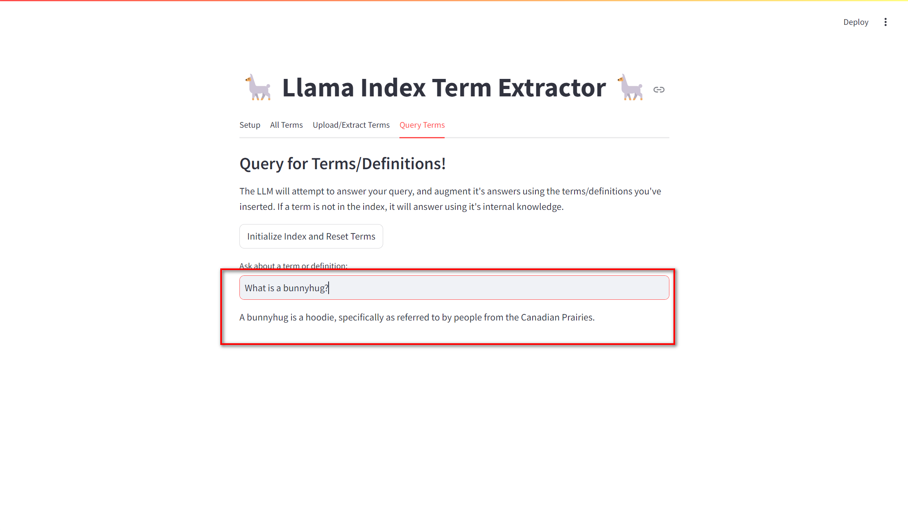

Check out the configuration reference at https://huggingface.co/docs/hub/spaces-config-reference

## Custom Tutorial

We can run this in the command:

``` bash
streamlit run app.py
```

> <font color="red">Important!!</font>
>
> First of all, we should remove the file `.initial_index/default_vector_store.json` or empty it.
>
> Otherwise we'll encounter an error:
>
> <font color="red">ValueError: shapes (1024,) and (1536,) not aligned: 1024 (dim 0) != 1536 (dim 0)</font>
>
> The reason is the content generated in `default_vector_store.json` was embedded by OpenAI Embedding models with a dimension of 1536 which conflicts to the current embedding model (with a dimension of 1024) that we are using.
>
> So to solve the problem, we can let our current embedding model to rewrite the  `default_vector_store.json` file.

Then we visit http://localhost:8501/, after a few seconds of initializing, we'll get the web page.

1. One tab `Setup`.

   

   - Fill in the Mistral API key
   - Choose an LLM, we can choose `mistral-small-latest` or`mistral-large-latest`
   - We use the default term extraction prompt.

2. `All Terms` tab shows the current Extracted Terms and Definitions.

   

   

3. On tab `Upload/Extract Terms`:

   

   First of all click the `Initialize Index and Reset Terms`.

   Then we can upload a file and  or enter raw text to let the LLM model extract Terms and Definitions

   for us.

   

4. On Tab `Query Terms`.

   We can ask a term or definition here.

   For example we can ask about "*New York City*", here and press Enter to apply.

   ``` bash 
   What is New York City?
   ```

   

   Then we get the exact info that we have offered in `app.py`.

   But if we ask 

   ``` bash
   What is a bunnyhug?
   ```

   It should give a nonsense response.

   ``` bash
   I'm sorry, but the context information provided does not include a definition for "bunnyhug." Therefore, I cannot provide an answer based on the given context. However, I can tell you that a "bunnyhug" is a regional term used in some parts of Canada, particularly in Saskatchewan, to refer to a hooded sweatshirt.
   ```

   

5. Then we should switch to the  `Upload/Extract Terms` :

   enter the following text:

   ``` bash
   A bunnyhug is a common term used to describe a hoodie. This term is used by people from the Canadian Prairies.
   ```

   Click `Extract Terms and Definitions` and wait it to show us the correct term/definition pair.

   

   We click `insert terms` button to add this info into term collections.

   After the insertion, we switch back to the tab `All Terms`, then we'll see  `bunnyhug` and its definition are saved and loaded.

    

6. We return to the  `Query Terms` and ask the same question before:

   It responses us the answer we have inserted a few moments before.

     

   
